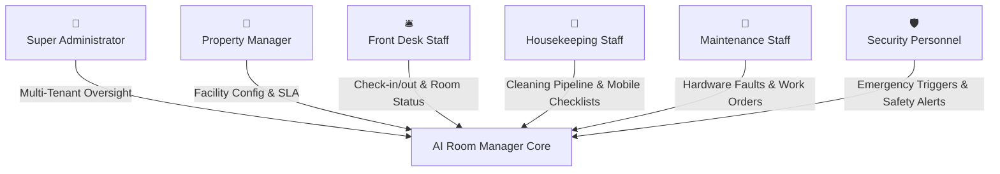
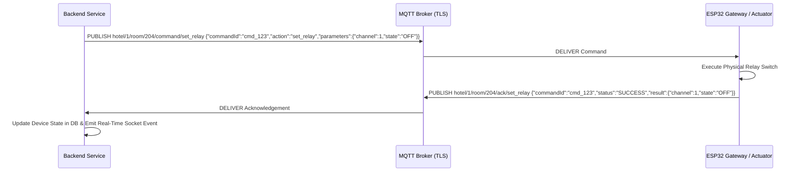

# 🏨 AI Room Manager — Enterprise IoT Hospitality Operations Platform

[]()
[]()
[]()
[]()
[]()
[]()

> **Enterprise Engagement:** ALLINZUCOLSMART SYSTEMS LTD (via ZORACOM COMMUNICATIONS LTD)  
> **Repository:** Backend Core & Real-Time IoT Integration Engine  
> **Status:** Active Development (Milestone 1 in progress)

---

## 📌 Table of Contents

1. [Executive Summary](#1-executive-summary)
2. [User Stories & Persona Roles](#2-user-stories--persona-roles)
3. [System Architecture & Module Boundaries](#3-system-architecture--module-boundaries)
4. [Relationship with Firmware & Hardware Ecosystem](#4-relationship-with-firmware--hardware-ecosystem)
5. [Authoritative Firmware ↔ Backend Communication Agreement](#5-authoritative-firmware--backend-communication-agreement)
6. [Tech Stack & Non-Negotiable Engineering Standards](#6-tech-stack--non-negotiable-engineering-standards)
7. [Project Roadmap & Engagement Tracker](#7-project-roadmap--engagement-tracker)
8. [Getting Started & Local Development](#8-getting-started--local-development)
9. [Documentation Directory](#9-documentation-directory)

---

## 1. Executive Summary

**AI Room Manager** is a cloud-native hospitality operations platform connecting physical IoT hardware (ESP32 gateways, PIR motion sensors, magnetic door contacts, environment sensors, and smart relays) to a real-time event engine, management dashboard, and field-operations workflow pipeline.

Designed for hotels, shortlets, serviced apartments, and residential properties, the platform delivers:

- **Autonomous Occupancy & Energy Management:** Multi-sensor fusion (PIR motion + door contact states) to infer precise occupancy without intrusive surveillance.
- **Dynamic Field Operations:** Real-time state machines for Housekeeping and Maintenance workflows with supervisor approvals and automated DND lockouts.
- **Safety-Critical Emergency Alerting:** Isolated, high-priority emergency processing for smoke, fire, panic triggers, water leaks, and intrusion alerts.
- **Low-Latency Edge Ingestion:** Decoupled, validated MQTT data pipelines capable of handling thousands of telemetry events per second.

---

## 2. User Stories & Persona Roles

The platform enforces Role-Based Access Control (RBAC) across **6 distinct user archetypes**, in addition to automated guest interaction loops:



### 1. Super Administrator (`SUPER_ADMIN`)

- *As a platform super administrator*, I want global oversight of multi-property tenants, system health, and administrative audit logs, so that I can ensure enterprise security, uptime, and manage client subscriptions.
- **Acceptance:** Full tenant creation, global user provisioning, system-wide configuration, access to immutable security audit logs.

### 2. Property Manager (`PROPERTY_MANAGER`)

- *As a property manager*, I want real-time visibility over room turnarounds, occupancy analytics, staff resolution times, and open maintenance tickets, so that I can maintain property profitability and guest satisfaction SLAs.
- **Acceptance:** Full CRUD on property buildings/floors/rooms, staff assignment oversight, occupancy history reporting, SLA metric tracking.

### 3. Front Desk Staff (`FRONT_DESK`)

- *As a front desk officer*, I want instant room state updates (Vacant Clean vs. Dirty, DND active, Occupied status) directly on my live console, so that I never assign an unready room to a guest and can respect guest privacy.
- **Acceptance:** Real-time room status console, guest check-in/check-out triggers, instant DND toggles, override inspection views.

### 4. Housekeeping Staff (`HOUSEKEEPING`)

- *As a housekeeping attendant*, I want a mobile-friendly task pipeline that automatically moves rooms from `Dirty` → `Assigned` → `In Progress` → `Inspection`, so that I know exactly which rooms to clean next and can submit rooms for supervisor sign-off.
- **Acceptance:** Task acceptance, live cleaning timer, checklist submission, automated lockout when Do-Not-Disturb is active.

### 5. Maintenance Staff (`MAINTENANCE`)

- *As a maintenance engineer*, I want to receive automated tickets when sensors report anomalies (e.g. water leaks, temperature spikes, or device offline states), so that I can resolve physical equipment issues before guests are impacted.
- **Acceptance:** Ticket queue management, parts tracking, resolution workflows, asset maintenance history.

### 6. Security Personnel (`SECURITY`)

- *As a security officer*, I want instant, zero-delay emergency alert flashes for smoke, fire, intrusion, and panic button triggers, so that our team can respond immediately with exact floor and room coordinates.
- **Acceptance:** Bypass all regular notification throttling, multi-tier escalation tracking, immutable incident logging.

---

## 3. System Architecture & Module Boundaries

The backend is built around a **strict event-driven domain architecture** that protects core business logic from hardware volatility:

```mermaid
flowchart LR
    subgraph Hardware["Physical Edge Nodes"]
        Sensors[PIR / Door / Temp] --> Gateway[ESP32 Gateway Node]
        Relays[Power Relays] <--> Gateway
    end

    subgraph IoTLayer["IoT Boundary (iot/)"]
        Gateway <== MQTT over TLS ==> MQTTService[MQTT Service / Topics]
        MQTTService --> Ingestion[Ingestion & TypeBox Validation]
        CommandPub[Command Publisher] --> MQTTService
    end

    subgraph EventBus["Internal Event Bus (EventEmitter2)"]
        Ingestion -.->|sensor.event| Bus((@OnEvent Bus))
        Ingestion -.->|emergency.event| EmBus((Emergency Bus))
    end

    subgraph DomainModules["Core Domain Services"]
        Bus --> OccupancyMod[Occupancy Engine]
        Bus --> DashboardMod[Real-Time Dashboard]
        EmBus ==> EmergencyMod[Emergency Alert System]
        OccupancyMod --> HousekeepingMod[Housekeeping Workflow]
        OccupancyMod --> MaintenanceMod[Maintenance Workflow]
        EmergencyMod --> NotificationMod[Notification Engine]
    end

    subgraph Persistence["PostgreSQL + Prisma"]
        DomainModules --> DB[(Core Database)]
        EmergencyMod --> AuditTrail[(Immutable Audit Log)]
    end
```

### Architectural Safeguards (per `backend/AGENTS.md`)

1. **The IoT Ingestion Boundary:** No module outside `iot/` may subscribe to MQTT topics directly or import from `iot/mqtt/`. Ingestion validates raw payloads using **TypeBox schemas** and emits normalized `SensorEvent` objects over `EventEmitter2`.

2. **Emergency Module Isolation:** The Emergency Alert System (`emergency/`) is safety-critical and isolated. It possesses its own escalation workflow engine, bypassing standard notification rate limiters.

3. **No Business Logic in Controllers:** Controllers strictly parse requests, apply `TypeBoxValidationPipe`, and invoke Domain Services.

4. **Append-Only Audit Trail:** All authentication events, security changes, and emergency triggers write immutable records to the `AuditLog` table.

---

## 4. Relationship with Firmware & Hardware Ecosystem

The backend and embedded firmware are developed as **independent repositories** maintained by separate teams.

| Dimension | Backend Team | Firmware / Embedded Team |
| ----- | ----- | ----- |
| **Repository** | `ai_room_manager` (NestJS / Bun) | `ai_room_firmware` (C++ / ESP-IDF / Arduino) |
| **Execution Environment** | Cloud Linux (Docker / Node / Bun) | ESP32-WROOM / ESP32-S3 Microcontrollers |
| **Network Layer** | Public Cloud / Private VPC | Local Wi-Fi / RS485 / Zigbee Mesh → Gateway |
| **Shared Source of Truth** | [`backend/docs/mqtt-contract.md`](backend/docs/mqtt-contract.md) | Shared contract file |
| **Contract Policy** | Any topic or payload change **requires simultaneous commit** in both repositories |

---

## 5. Authoritative Firmware ↔ Backend Communication Agreement

The full, normative contract is documented in [**`backend/docs/mqtt-contract.md`**](backend/docs/mqtt-contract.md). A summary of core topics and payload contracts is provided below:

### 5.1. Topic Registry

```
hotel/{property_id}/room/{room_id}/sensor/{sensor_type}   -> Telemetry Ingestion (QoS 1)
hotel/{property_id}/room/{room_id}/emergency              -> Life-Safety Alerts (QoS 2)
hotel/{property_id}/gateway/{gateway_id}/heartbeat        -> Gateway & Health Telemetry (QoS 1)
hotel/{property_id}/room/{room_id}/command/{action}       -> Backend-to-Edge Commands (QoS 1)
hotel/{property_id}/room/{room_id}/ack/{action}           -> Edge Command Confirmations (QoS 1)
```

### 5.2. Core Payload Schemas

#### A. PIR Motion Telemetry
```json
{
  "version": "1.0",
  "deviceId": "pir_esp32_01_a9f2",
  "gatewayId": "gw_floor2_001",
  "sensorType": "pir",
  "value": {
    "motionDetected": true,
    "confidenceScore": 0.98,
    "durationMs": 4200
  },
  "occurredAt": "2026-08-21T16:00:00.000Z"
}
```

#### B. Door Position Sensor
```json
{
  "version": "1.0",
  "deviceId": "door_contact_01_b12c",
  "gatewayId": "gw_floor2_001",
  "sensorType": "door",
  "value": {
    "state": "CLOSED",
    "durationInPreviousStateSec": 120
  },
  "occurredAt": "2026-08-21T16:00:05.120Z"
}
```

#### C. Gateway Heartbeat (Online/Offline Tracking)
```json
{
  "version": "1.0",
  "gatewayId": "gw_floor2_001",
  "ipAddress": "192.168.10.45",
  "macAddress": "98:CD:AC:12:34:56",
  "firmwareVersion": "v2.1.4-prod",
  "uptimeSeconds": 86400,
  "wifiRssi": -58,
  "connectedNodesCount": 8,
  "timestamp": "2026-08-21T16:00:30.000Z"
}
```
*Heartbeats fire every 30s. Missing 3 consecutive heartbeats (90s) marks the gateway `OFFLINE`.*

#### D. Emergency Trigger (Smoke, Panic, Fire, Intrusion, Water Leak)
```json
{
  "version": "1.0",
  "eventId": "evt_emg_98234ab1",
  "gatewayId": "gw_floor2_001",
  "deviceId": "smoke_sensor_01_d90e",
  "alertType": "SMOKE",
  "severity": "CRITICAL",
  "details": {
    "sensorRawValue": 450,
    "thresholdValue": 200,
    "zone": "BEDROOM_CEILING"
  },
  "triggeredAt": "2026-08-21T16:01:10.000Z"
}
```

#### E. Command & Acknowledgement Loop


---

## 6. Tech Stack & Non-Negotiable Engineering Standards

| Layer | Technology |
|---|---|
| **Runtime** | Bun 1.x (Ultra-fast package execution & test runner) |
| **Framework** | NestJS 10 (Modular Enterprise TypeScript Framework) |
| **Language** | TypeScript (Strict mode enabled — `noImplicitAny`, `exactOptionalPropertyTypes`) |
| **Database & ORM** | PostgreSQL + Prisma ORM |
| **Validation** | TypeBox (`@sinclair/typebox`) — **No class-validator, No Zod** |
| **Auth & Security** | Passport JWT (Access + Refresh Token Rotation, bcrypt hashing) |
| **IoT Protocol** | MQTT over TLS (`mqtt` v5 client) |
| **Realtime Push** | Socket.IO (`@nestjs/websockets`) |
| **Latency Tracking** | Built-in `response-time` middleware emitting wall-clock latency per request |
| **Testing** | Jest (Unit & Service specs) + Supertest (E2E) |

### Strict Quality Rules (per `backend/AGENTS.md`)
- 🚫 **No `any`:** Strict types only. Use `unknown` + TypeBox narrowing.
- 🚫 **No `console.log`:** Built-in NestJS `Logger` must be used everywhere with structured JSON context.
- 🧪 **Mandatory Testing Thresholds:**
  - Statements: `80%` minimum
  - Branches: `80%` minimum
  - Functions: `90%` minimum
  - Lines: `80%` minimum

---

## 7. Project Roadmap & Engagement Tracker

Tracked in detail in [**`backend/project_tracker.md`**](backend/project_tracker.md):

```
Milestone 1: Foundation & Core Architecture (Weeks 1–4)
├── ✅ Week 1: Project Scaffolding, Prisma Models, Auth & Access Control, Audit Log
├── ⏳ Week 2: Property & Multi-Tenant Hierarchy, Room State Machine
├── ⏳ Week 3: Housekeeping Workflow Engine & Supervisor Sign-off
└── ⏳ Week 4: Device Registry, MQTT Ingestion Pipeline, Simulated Tests

Milestone 2: Operations Layer (Weeks 5–8)
├── ⏳ Week 5–6: Maintenance Ticketing & Multi-Sensor Occupancy Fusion
├── ⏳ Week 7: Real-Time WebSocket Dashboard & Cross-Channel Notifications
└── ⏳ Week 8: Do-Not-Disturb (DND) Logic & Automated Lockouts

Milestone 3: Safety Systems, Launch & Handoff (Weeks 9–13)
├── ⏳ Week 9–10: Emergency Alert System (7 Alert Types & Multi-Tier Escalation)
├── ⏳ Week 11: Occupancy Limit & Crowd Detection Engine
├── ⏳ Week 12: DevOps, TLS Hardening, Per-Device MQTT ACLs & Load Testing
└── ⏳ Week 13: UAT Sign-off, Documentation, Client Training & Handoff
```

---

## 8. Getting Started & Local Development

### Prerequisites
- [Bun](https://bun.sh/) (v1.1+) or Node.js (v20+)
- PostgreSQL (v14+)
- An MQTT broker instance (e.g. Mosquitto, EMQX) for local ingestion testing

### Installation & Bootstrap
```bash
# 1. Navigate to backend directory
cd backend

# 2. Install dependencies with Bun
bun install

# 3. Configure environment variables
cp .env.example .env
# Edit .env and supply DATABASE_URL, JWT secrets (32+ chars), MQTT broker credentials

# 4. Generate Prisma client & run database migrations
npx prisma generate
npx prisma migrate dev --name init

# 5. Run the development server
bun run start:dev
```

### Running Test Suite & Coverage
```bash
# Run unit tests
bun run test

# Run test coverage verification against strict thresholds
bun run test:cov

# Type check
npx tsc --noEmit
```

---

## 9. Documentation Directory

| Document | Description |
|---|---|
| [`backend/AGENTS.md`](backend/AGENTS.md) | **Primary Rulebook:** Architectural patterns, strict TS rules, testing bars |
| [`backend/project_tracker.md`](backend/project_tracker.md) | Engagement tracker: Weekly milestones, delivery dates, fee schedule |
| [`backend/docs/mqtt-contract.md`](backend/docs/mqtt-contract.md) | Authoritative MQTT topic & payload contract shared with Firmware |
| [`GEMINI.md`](GEMINI.md) | Root AI engineering context file |

---

**© 2026 ALLINZUCOLSMART SYSTEMS LTD. Confidential & Proprietary.**
