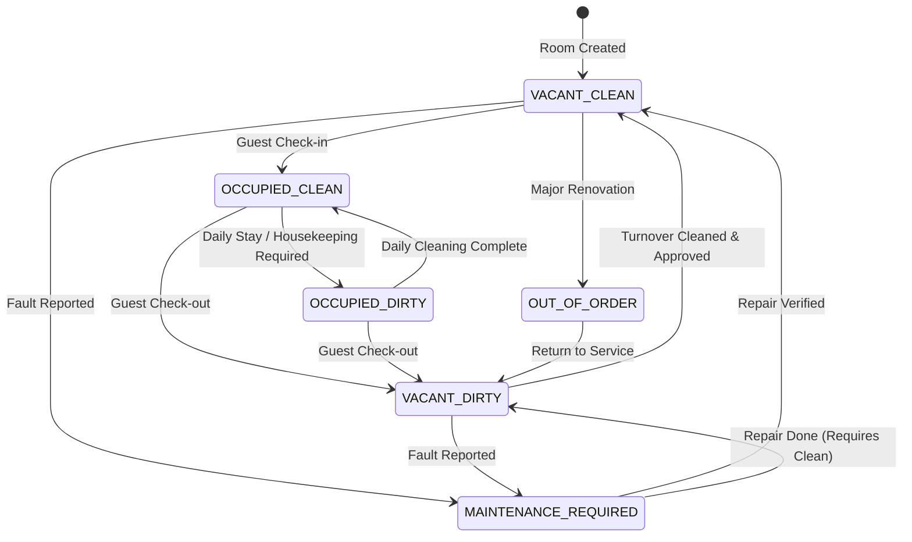
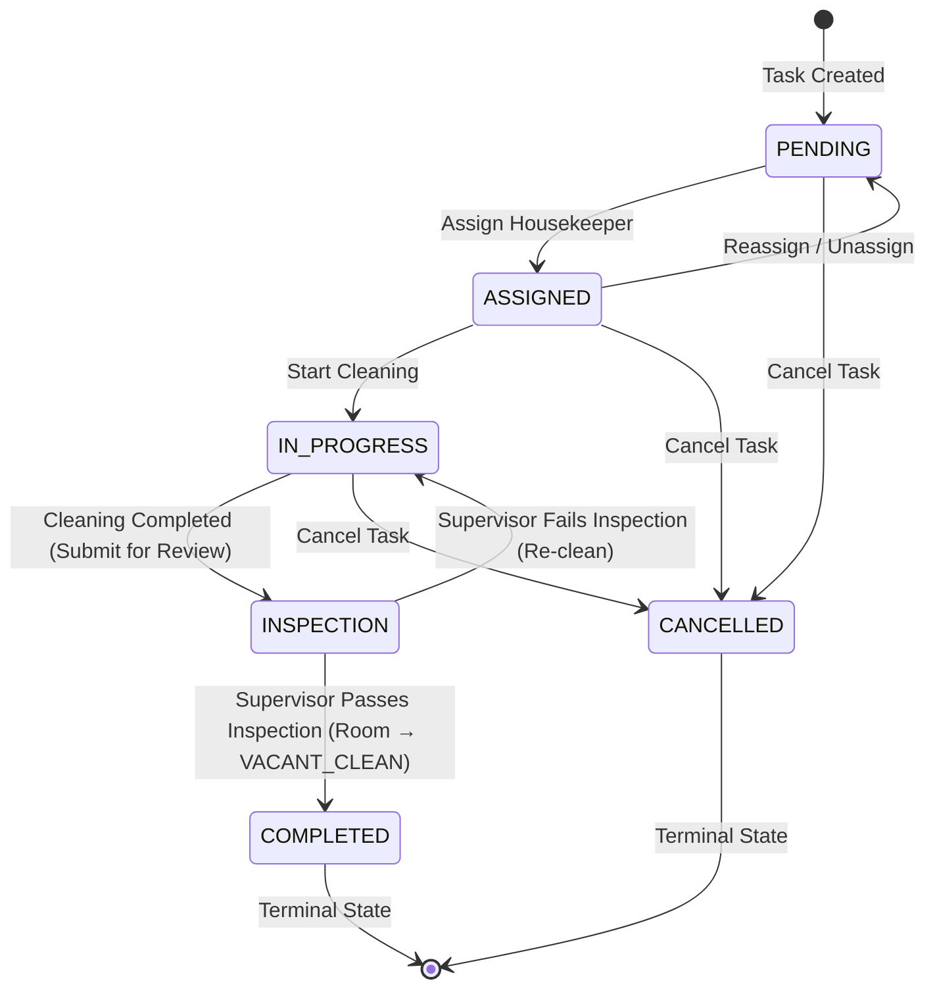

# AI Room Manager — REST API Documentation
**ALLINZUCOLSMART SYSTEMS LTD / ZORACOM**  
**Version:** 1.0.0  
**Base URL:** `http://localhost:3000/api/v1` (Dev) | `https://api.azsmartsystem.com/api/v1` (Prod)  
**Interactive Swagger UI:** `http://localhost:3000/docs`

---

## 1. Authentication & Security Overview

The AI Room Manager API uses **JWT Bearer Token Authentication** with **Refresh Token Rotation**.

### Headers
All protected endpoints require the following HTTP request headers:
```http
Authorization: Bearer <ACCESS_TOKEN>
Content-Type: application/json
```

### Role-Based Access Control (RBAC)
Every authenticated user possesses one of 6 strict system roles:
1. `SUPER_ADMIN`: Global system administrator. Has access across all properties and settings.
2. `PROPERTY_MANAGER`: Scoped administrator for assigned properties, buildings, floors, rooms, and staff.
3. `FRONT_DESK`: Operates check-in/check-out, room status overview, and occupancy status.
4. `HOUSEKEEPING`: Receives room turnaround assignments, updates room cleaning states.
5. `MAINTENANCE`: Handles facility maintenance work orders and device repairs.
6. `SECURITY`: Monitors safety sensors, receives and manages emergency alerts.

---

## 2. Standard Response Envelope & Error Format

All error responses return a standardized, predictable RFC 7807-compliant payload:

```json
{
  "statusCode": 400,
  "errorCode": "INVALID_ROOM_STATE_TRANSITION",
  "message": "Cannot transition room from 'VACANT_DIRTY' to 'OCCUPIED_CLEAN'. Guest cannot check into a dirty room.",
  "timestamp": "2026-08-21T18:30:00.000Z",
  "path": "/api/v1/properties/rooms/039c36b4-8ee7-4da3-aef3-a3d8442a8b94/status",
  "method": "PATCH",
  "details": {
    "fromStatus": "VACANT_DIRTY",
    "toStatus": "OCCUPIED_CLEAN",
    "reason": "Guest cannot check into a dirty room"
  }
}
```

---

## 3. Authentication Endpoints (`/api/v1/auth`)

### 3.1 Public User Registration
- **Endpoint:** `POST /api/v1/auth/register`
- **Access:** Public
- **Description:** Registers a new user account (e.g. initial super administrator or organization signup).

#### Request Body
```json
{
  "email": "admin@hotel.com",
  "password": "Password123!",
  "firstName": "Super",
  "lastName": "Admin",
  "role": "SUPER_ADMIN"
}
```

#### Response (`201 Created`)
```json
{
  "accessToken": "eyJhbGciOiJIUzI1NiIsInR5cCI6IkpXVCJ9...",
  "refreshToken": "7c9e6679f71c4c1a8d9b23a5f82c...",
  "user": {
    "id": "c7a8b9e0-1234-5678-9abc-def012345678",
    "email": "admin@hotel.com",
    "firstName": "Super",
    "lastName": "Admin",
    "role": "SUPER_ADMIN",
    "status": "ACTIVE",
    "propertyId": null,
    "createdAt": "2026-08-21T18:00:00.000Z",
    "updatedAt": "2026-08-21T18:00:00.000Z"
  }
}
```

---

### 3.2 User Login
- **Endpoint:** `POST /api/v1/auth/login`
- **Access:** Public
- **Description:** Authenticates with email and password. Generates JWT access token (15m validity) and secure refresh token (7d validity).

#### Request Body
```json
{
  "email": "manager@grandroyal.com",
  "password": "Password123!"
}
```

#### Response (`200 OK`)
```json
{
  "accessToken": "eyJhbGciOiJIUzI1NiIsInR5cCI6IkpXVCJ9...",
  "refreshToken": "9d8e7f6a5b4c3d2e1f0a9b8c...",
  "user": {
    "id": "d1e2f3a4-b5c6-7d8e-9f0a-1b2c3d4e5f6a",
    "email": "manager@grandroyal.com",
    "firstName": "Folake",
    "lastName": "Adeyemi",
    "role": "PROPERTY_MANAGER",
    "status": "ACTIVE",
    "propertyId": "p1234567-89ab-cdef-0123-456789abcdef"
  }
}
```

---

### 3.3 Refresh Access Token
- **Endpoint:** `POST /api/v1/auth/refresh`
- **Access:** Public
- **Description:** Rotates existing refresh token and issues a new access/refresh pair.

#### Request Body
```json
{
  "refreshToken": "9d8e7f6a5b4c3d2e1f0a9b8c..."
}
```

#### Response (`200 OK`)
```json
{
  "accessToken": "eyJhbGciOiJIUzI1NiIsInR5cCI6IkpXVCJ9...",
  "refreshToken": "4a5b6c7d8e9f0a1b2c3d4e5f..."
}
```

---

### 3.4 Logout
- **Endpoint:** `POST /api/v1/auth/logout`
- **Access:** Public
- **Description:** Revokes the provided refresh token session.

#### Request Body
```json
{
  "refreshToken": "4a5b6c7d8e9f0a1b2c3d4e5f..."
}
```

#### Response (`200 OK`)
```json
{
  "message": "Logged out successfully"
}
```

---

### 3.5 Password Reset Flow
- **Step 1: Request Reset Token** (`POST /api/v1/auth/password-reset/request`)
  ```json
  { "email": "manager@grandroyal.com" }
  ```
  *Response (`200 OK`):* `{"message": "If an account exists, a password reset link has been dispatched."}`

- **Step 2: Submit New Password** (`POST /api/v1/auth/password-reset/reset`)
  ```json
  {
    "token": "raw-reset-token-received-via-email",
    "newPassword": "NewSecurePassword456!"
  }
  ```
  *Response (`200 OK`):* `{"message": "Password has been successfully updated. Please log in with your new password."}`

---

## 4. User Management Endpoints (`/api/v1/users`)

### 4.1 Provision Staff Account
- **Endpoint:** `POST /api/v1/users`
- **Access:** `SUPER_ADMIN`, `PROPERTY_MANAGER`
- **Description:** Creates an operational staff account. Property Managers are automatically restricted to creating staff within their assigned property.

#### Request Body
```json
{
  "email": "cleaner1@grandroyal.com",
  "password": "Password123!",
  "firstName": "Amina",
  "lastName": "Bello",
  "role": "HOUSEKEEPING",
  "propertyId": "p1234567-89ab-cdef-0123-456789abcdef"
}
```

#### Response (`201 Created`)
```json
{
  "user": {
    "id": "u9876543-21ba-dcfe-3210-fedcba987654",
    "email": "cleaner1@grandroyal.com",
    "firstName": "Amina",
    "lastName": "Bello",
    "role": "HOUSEKEEPING",
    "status": "ACTIVE",
    "propertyId": "p1234567-89ab-cdef-0123-456789abcdef",
    "createdAt": "2026-08-21T18:15:00.000Z"
  }
}
```

---

### 4.2 List Users
- **Endpoint:** `GET /api/v1/users?propertyId=<UUID>`
- **Access:** `SUPER_ADMIN`, `PROPERTY_MANAGER`
- **Description:** Returns staff members matching query or scoped tenant.

#### Response (`200 OK`)
```json
{
  "users": [
    {
      "id": "u9876543-21ba-dcfe-3210-fedcba987654",
      "email": "cleaner1@grandroyal.com",
      "firstName": "Amina",
      "lastName": "Bello",
      "role": "HOUSEKEEPING",
      "status": "ACTIVE",
      "propertyId": "p1234567-89ab-cdef-0123-456789abcdef"
    }
  ]
}
```

---

### 4.3 Update User Status
- **Endpoint:** `PATCH /api/v1/users/:id/status`
- **Access:** `SUPER_ADMIN`, `PROPERTY_MANAGER`
- **Body:** `{"status": "SUSPENDED"}` (Options: `ACTIVE`, `INACTIVE`, `SUSPENDED`)

---

## 5. Property & Structural Hierarchy Endpoints (`/api/v1/properties`)

### 5.1 Properties Management

#### Create Property
- **Endpoint:** `POST /api/v1/properties`
- **Access:** `SUPER_ADMIN` only
- **Body:**
  ```json
  {
    "name": "Grand Royal Hotel Lagos",
    "code": "PROP_LAGOS_01",
    "address": "14 Victoria Island Boulevard",
    "city": "Lagos",
    "country": "Nigeria"
  }
  ```
- **Response (`201 Created`)**

#### List Properties
- **Endpoint:** `GET /api/v1/properties`
- **Access:** `SUPER_ADMIN`, `PROPERTY_MANAGER`, `FRONT_DESK`
- **Description:** `SUPER_ADMIN` receives all properties; other roles receive their assigned property.

#### Get Property Hierarchy
- **Endpoint:** `GET /api/v1/properties/:id`
- **Access:** `SUPER_ADMIN`, `PROPERTY_MANAGER`, `FRONT_DESK`
- **Description:** Returns full nested hierarchy: Property → Buildings → Floors → Rooms.

---

### 5.2 Buildings & Floors Management

#### Add Building
- **Endpoint:** `POST /api/v1/properties/:propertyId/buildings`
- **Access:** `SUPER_ADMIN`, `PROPERTY_MANAGER`
- **Body:** `{"name": "Main Tower"}`

#### List Buildings
- **Endpoint:** `GET /api/v1/properties/:propertyId/buildings`
- **Access:** `SUPER_ADMIN`, `PROPERTY_MANAGER`, `FRONT_DESK`

#### Add Floor to Building
- **Endpoint:** `POST /api/v1/properties/buildings/:buildingId/floors`
- **Access:** `SUPER_ADMIN`, `PROPERTY_MANAGER`
- **Body:** `{"number": 1, "name": "Executive Level"}`

#### List Floors in Building
- **Endpoint:** `GET /api/v1/properties/buildings/:buildingId/floors`
- **Access:** `SUPER_ADMIN`, `PROPERTY_MANAGER`, `FRONT_DESK`

---

### 5.3 Rooms Management

#### Create Room
- **Endpoint:** `POST /api/v1/properties/:propertyId/rooms`
- **Access:** `SUPER_ADMIN`, `PROPERTY_MANAGER`
- **Body:**
  ```json
  {
    "number": "101",
    "buildingId": "b1234567-89ab-cdef-0123-456789abcdef",
    "floorId": "f1234567-89ab-cdef-0123-456789abcdef",
    "maxOccupancy": 2,
    "status": "VACANT_CLEAN"
  }
  ```

#### List Rooms
- **Endpoint:** `GET /api/v1/properties/:propertyId/rooms?status=VACANT_CLEAN`
- **Access:** All Authenticated Staff
- **Query Params:** `status` (optional: `VACANT_CLEAN`, `VACANT_DIRTY`, `OCCUPIED_CLEAN`, `OCCUPIED_DIRTY`, `OUT_OF_ORDER`, `MAINTENANCE_REQUIRED`)

#### Get Single Room Details
- **Endpoint:** `GET /api/v1/properties/rooms/:id`
- **Access:** All Authenticated Staff
- **Description:** Returns room details, paired IoT devices, latest occupancy telemetry, and recent housekeeping/maintenance history.

---

## 6. Room Status State Machine (`PATCH /api/v1/properties/rooms/:id/status`)

- **Endpoint:** `PATCH /api/v1/properties/rooms/:id/status`
- **Access:** `SUPER_ADMIN`, `PROPERTY_MANAGER`, `FRONT_DESK`, `HOUSEKEEPING`, `MAINTENANCE`

### State Transition Matrix



#### Allowed Transitions:
| From State | Allowed Target States |
|---|---|
| `VACANT_CLEAN` | `OCCUPIED_CLEAN`, `VACANT_DIRTY`, `MAINTENANCE_REQUIRED`, `OUT_OF_ORDER` |
| `VACANT_DIRTY` | `VACANT_CLEAN`, `MAINTENANCE_REQUIRED`, `OUT_OF_ORDER` |
| `OCCUPIED_CLEAN` | `VACANT_DIRTY`, `OCCUPIED_DIRTY`, `MAINTENANCE_REQUIRED`, `OUT_OF_ORDER` |
| `OCCUPIED_DIRTY` | `OCCUPIED_CLEAN`, `VACANT_DIRTY`, `MAINTENANCE_REQUIRED`, `OUT_OF_ORDER` |
| `MAINTENANCE_REQUIRED` | `VACANT_CLEAN`, `VACANT_DIRTY`, `OUT_OF_ORDER` |
| `OUT_OF_ORDER` | `VACANT_DIRTY`, `MAINTENANCE_REQUIRED` |

#### Request Example (Check-in):
```json
{
  "status": "OCCUPIED_CLEAN",
  "reason": "Guest checked in at front desk"
}
```

---

## 7. IoT Device Assignment (`/api/v1/properties/rooms/:roomId/devices`)

### 7.1 Pair Device to Room
- **Endpoint:** `POST /api/v1/properties/rooms/:roomId/devices`
- **Access:** `SUPER_ADMIN`, `PROPERTY_MANAGER`
- **Description:** Binds a physical edge device (e.g. ESP32 Gateway, Sensor Node) to a specific room. Automatically registers hardware ID if not previously provisioned.

#### Request Body
```json
{
  "deviceId": "GW_LAGOS_TOWER_A_R101"
}
```

#### Response (`200 OK`)
```json
{
  "id": "GW_LAGOS_TOWER_A_R101",
  "type": "GATEWAY",
  "roomId": "r1234567-89ab-cdef-0123-456789abcdef",
  "propertyId": "p1234567-89ab-cdef-0123-456789abcdef",
  "isOnline": false,
  "createdAt": "2026-08-21T18:20:00.000Z"
}
```

---

### 7.2 Unassign Device from Room
- **Endpoint:** `POST /api/v1/properties/rooms/:roomId/devices/:deviceId/unassign`
- **Access:** `SUPER_ADMIN`, `PROPERTY_MANAGER`
- **Response (`200 OK`):** Disconnects hardware binding and records action in the immutable audit log.

---

## 8. Housekeeping Workflow Endpoints (`/api/v1/properties/:propertyId/housekeeping`)

The Housekeeping module manages the lifecycle of room turnaround and cleaning operations, dynamic staff dispatch, live cleaning progress tracking, supervisor sign-offs, and operational turnaround analytics.

### 8.1 Housekeeping Task Lifecycle State Machine



#### Task Transition Rules:
| From State | Allowed Target States | Trigger / Notes |
|---|---|---|
| `PENDING` | `ASSIGNED`, `CANCELLED` | Housekeeper assigned or task aborted |
| `ASSIGNED` | `IN_PROGRESS`, `PENDING`, `CANCELLED` | Housekeeper starts, gets unassigned, or task aborted |
| `IN_PROGRESS` | `INSPECTION`, `CANCELLED` | Cleaner submits for inspection |
| `INSPECTION` | `COMPLETED`, `IN_PROGRESS` | Pass (promotes room to `VACANT_CLEAN`) or Fail (re-clean) |
| `COMPLETED` | *None* | Terminal state |
| `CANCELLED` | *None* | Terminal state |

---

### 8.2 Create Housekeeping Task
- **Endpoint:** `POST /api/v1/properties/:propertyId/housekeeping/tasks`
- **Access:** `SUPER_ADMIN`, `PROPERTY_MANAGER`, `FRONT_DESK`
- **Description:** Creates a new task in `PENDING` status for a room.

#### Request Body
```json
{
  "roomId": "039c36b4-8ee7-4da3-aef3-a3d8442a8b94",
  "priority": "HIGH",
  "notes": "Deep clean required — previous guest stayed 14 days."
}
```
*Note: `priority` is optional (`LOW`, `MEDIUM`, `HIGH`, `CRITICAL`; defaults to `MEDIUM`).*

#### Response (`201 Created`)
```json
{
  "id": "t1234567-89ab-cdef-0123-456789abcdef",
  "roomId": "039c36b4-8ee7-4da3-aef3-a3d8442a8b94",
  "assignedToId": null,
  "inspectedById": null,
  "status": "PENDING",
  "priority": "HIGH",
  "startedAt": null,
  "completedAt": null,
  "inspectedAt": null,
  "notes": "Deep clean required — previous guest stayed 14 days.",
  "createdAt": "2026-08-26T15:00:00.000Z",
  "updatedAt": "2026-08-26T15:00:00.000Z",
  "room": {
    "id": "039c36b4-8ee7-4da3-aef3-a3d8442a8b94",
    "number": "101",
    "propertyId": "p1234567-89ab-cdef-0123-456789abcdef"
  },
  "assignedTo": null,
  "inspectedBy": null
}
```

---

### 8.3 List Tasks
- **Endpoint:** `GET /api/v1/properties/:propertyId/housekeeping/tasks`
- **Access:** `SUPER_ADMIN`, `PROPERTY_MANAGER`, `FRONT_DESK`, `HOUSEKEEPING`, `SECURITY`
- **Query Parameters:**
  - `status` (optional): Filter by `PENDING`, `ASSIGNED`, `IN_PROGRESS`, `INSPECTION`, `COMPLETED`, `CANCELLED`
  - `assignedToId` (optional): Filter by assigned housekeeper UUID
  - `roomId` (optional): Filter by room UUID

#### Response (`200 OK`)
```json
[
  {
    "id": "t1234567-89ab-cdef-0123-456789abcdef",
    "roomId": "039c36b4-8ee7-4da3-aef3-a3d8442a8b94",
    "assignedToId": "u9876543-21ba-dcfe-3210-fedcba987654",
    "status": "ASSIGNED",
    "priority": "HIGH",
    "room": { "id": "...", "number": "101", "propertyId": "..." },
    "assignedTo": {
      "id": "u9876543-21ba-dcfe-3210-fedcba987654",
      "firstName": "Amina",
      "lastName": "Bello",
      "email": "cleaner1@grandroyal.com",
      "role": "HOUSEKEEPING"
    },
    "createdAt": "2026-08-26T15:00:00.000Z"
  }
]
```

---

### 8.4 Get Single Task
- **Endpoint:** `GET /api/v1/properties/:propertyId/housekeeping/tasks/:taskId`
- **Access:** All Authenticated Staff (except `MAINTENANCE`)
- **Response (`200 OK`):** Returns full task details including populated room, assigned housekeeper, and inspecting supervisor.

---

### 8.5 Assign / Reassign Task
- **Endpoint:** `PATCH /api/v1/properties/:propertyId/housekeeping/tasks/:taskId/assign`
- **Access:** `SUPER_ADMIN`, `PROPERTY_MANAGER`
- **Description:** Assigns task to a staff member with role `HOUSEKEEPING`. If previously assigned, handles re-assignment smoothly.

#### Request Body
```json
{
  "assignedToId": "u9876543-21ba-dcfe-3210-fedcba987654"
}
```

#### Response (`200 OK`)
Task transitions to `ASSIGNED`.

---

### 8.6 Start Task
- **Endpoint:** `PATCH /api/v1/properties/:propertyId/housekeeping/tasks/:taskId/start`
- **Access:** `SUPER_ADMIN`, `PROPERTY_MANAGER`, `HOUSEKEEPING`
- **Description:** Transitions task from `ASSIGNED` to `IN_PROGRESS` and stamps `startedAt` with current UTC timestamp.

#### Response (`200 OK`)

---

### 8.7 Submit Task for Inspection
- **Endpoint:** `PATCH /api/v1/properties/:propertyId/housekeeping/tasks/:taskId/submit`
- **Access:** `SUPER_ADMIN`, `PROPERTY_MANAGER`, `HOUSEKEEPING`
- **Description:** Housekeeper signals cleaning completion. Transitions `IN_PROGRESS` to `INSPECTION`.

#### Request Body (Optional)
```json
{
  "notes": "Cleaning done, fresh linen and amenities replaced."
}
```

#### Response (`200 OK`)

---

### 8.8 Inspect Task (Supervisor Sign-off)
- **Endpoint:** `PATCH /api/v1/properties/:propertyId/housekeeping/tasks/:taskId/inspect`
- **Access:** `SUPER_ADMIN`, `PROPERTY_MANAGER`
- **Description:** Supervisor signs off on cleaning quality.
  - **Passed (`true`):** Task transitions to `COMPLETED`, stamps `completedAt` and `inspectedAt`, and **automatically promotes the associated room to `VACANT_CLEAN`**.
  - **Failed (`false`):** Task transitions back to `IN_PROGRESS` for re-cleaning.

#### Request Body
```json
{
  "passed": true,
  "notes": "Passes 5-star standard inspection."
}
```

#### Response (`200 OK`)

---

### 8.9 Cancel Task
- **Endpoint:** `PATCH /api/v1/properties/:propertyId/housekeeping/tasks/:taskId/cancel`
- **Access:** `SUPER_ADMIN`, `PROPERTY_MANAGER`
- **Description:** Cancels task (only allowed on non-completed tasks).

---

### 8.10 Operational Metrics & Turnaround Reporting
- **Endpoint:** `GET /api/v1/properties/:propertyId/housekeeping/metrics`
- **Access:** `SUPER_ADMIN`, `PROPERTY_MANAGER`
- **Description:** Provides real-time operational efficiency insights, backlog counts, average cleaning turnaround times (minutes), and individual housekeeper performance metrics.

#### Response (`200 OK`)
```json
{
  "backlog": 4,
  "completedCount": 28,
  "avgTurnaroundMinutes": 32.5,
  "staffPerformance": [
    {
      "userId": "u9876543-21ba-dcfe-3210-fedcba987654",
      "fullName": "Amina Bello",
      "completedTasks": 15,
      "avgTurnaroundMinutes": 28.4
    },
    {
      "userId": "u1234567-43ba-dcfe-5678-fedcba123456",
      "fullName": "Chinedu Okafor",
      "completedTasks": 13,
      "avgTurnaroundMinutes": 37.2
    }
  ]
}
```
